# prueba-finaktiva
Prueba Tecnica de Ingreso Finaktiva

## Como empezar
Estas son las instrucciones para clonar y ejecutar los proyectos localmente.

### Prerrequisitos
Para el proyecto BackendFinaktiva tener instalado lo siguiente:
- Visual Studio 2022
- .Net Core 6.0
- SQL Server

Para el proyecto FrontendFinaktiva tener instalado lo siguiente:
- Angular CLI: 16.0.0
- Node.js: 18.12.0
- Npm: 10.4.0

### Instalación
1. Clona el repositorio: `git clone https://github.com/EfraMonR/prueba-finaktiva.git`
2. Abre el archivo Script-DBRegistration.sql y ejecutado en SQL (Esto creara la base de datos Registration y la tabla EventLogs).

### Configuración proyecto BackendFinaktiva
1. Ejectua el archivo BackendFinaktiva.sln con Visual Studio 2022

2. Verifica configuración de base de datos el archivo appsettings.json ubicado: 
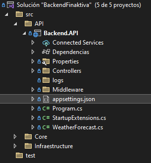

3. Modifica configuración segun entorno local e instancia:
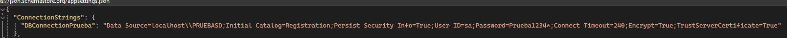

4. Ejecuta el proyecto para que el api comience su funcionamiento:
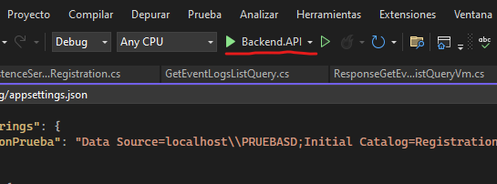

5. Se abre de manera automatica el navegador ejecutando swagger:
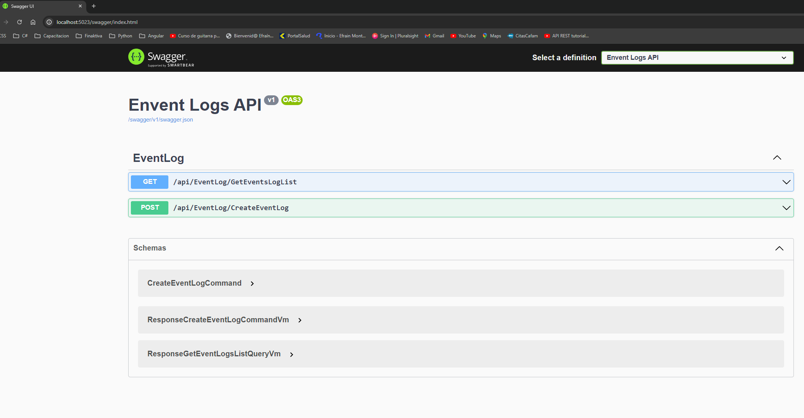

6. Dejar abierto el navegador.

### Configuración proyecto FrontendFinaktiva
1. Abre el proyecto con Visual Studio Code.

2. Abrir terminal de VS Code.

3. Ejecutar el comando `npm install` para actualizar dependencias:
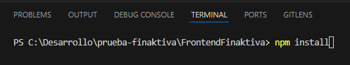

4. Ejecutar el comando `ng serve` para iniciar el proyecto
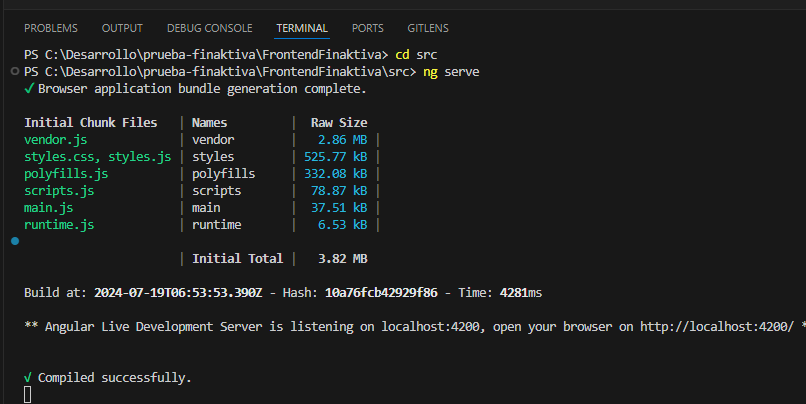

5. Iniciar el navegador de preferencia y escribir en la url `http://localhost:4200/` :
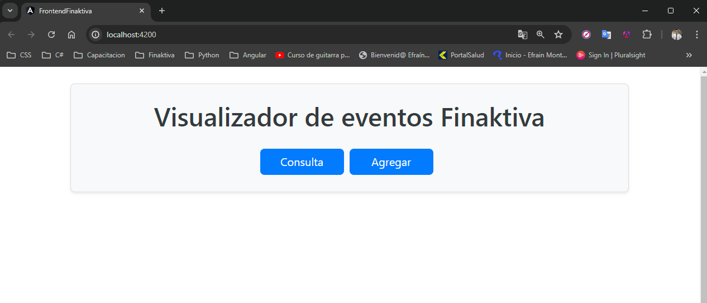

6. Clickear el boton consulta y de esta forma se abrirá un modal que me permite consultar los eventos registrados en la tabla EventLogs de la base de datos
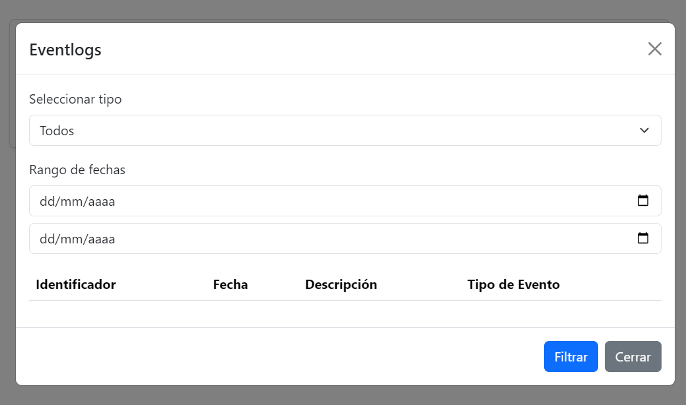

7. Alli se pueden configurar los filtros solicitados en la problematica a resolver
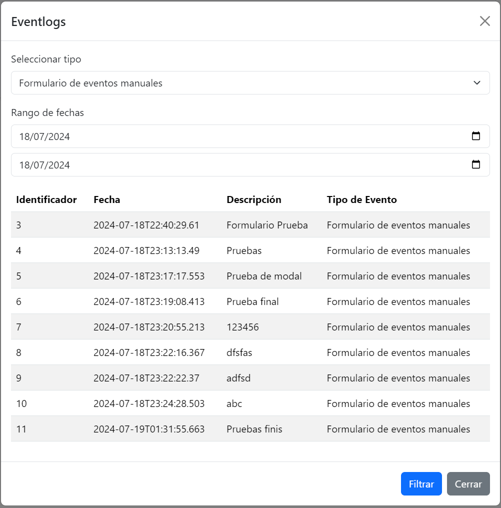

8. Clickear el boton agregar me permite agregar un evento manual
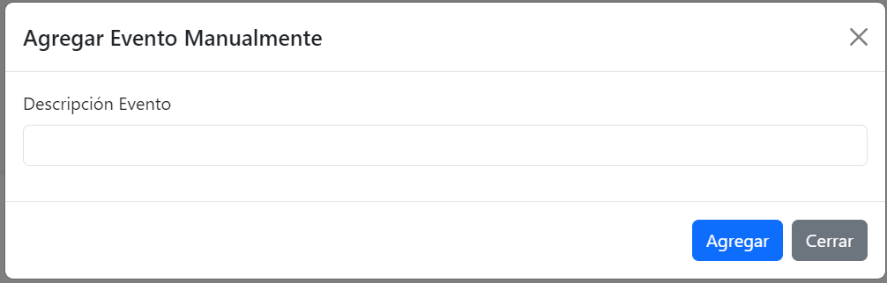

9. Si no se diligencian campos, genera advertencia y no permite seguir
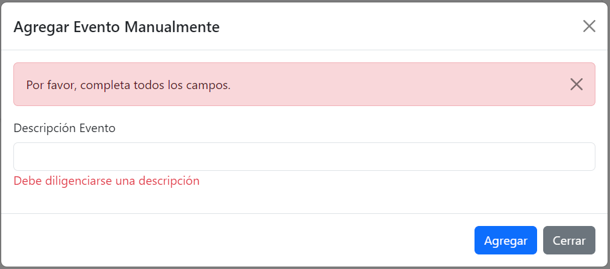

10. Al diligenciar el campo permite agregar el evento
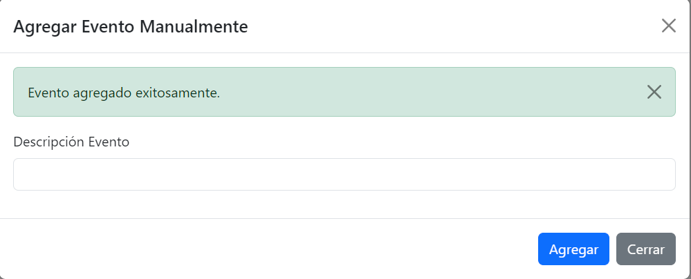

### IMPORTANTE
1. Ambos proyectos deben estar en ejecución de manera simultanea para su funcionamiento.

2. Se envia colección de postman para pruebas de api. Recordar que debe estar corriendo el proyecto en visual studio.
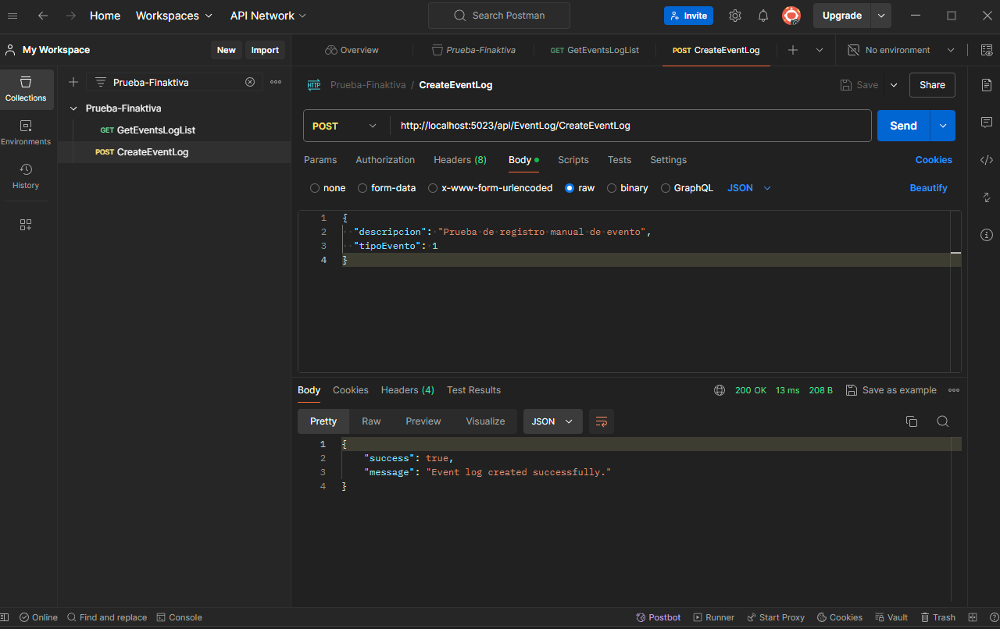

Es de suma importancia enviar el tipoEvento como 1, dado que es la forma en que identificamos que fue ejecutada directamente desde el api, sin pasar por el front.

3. Se realizó manejo de ramas, desarrollo en develop, pruebas en release y producto final en master.